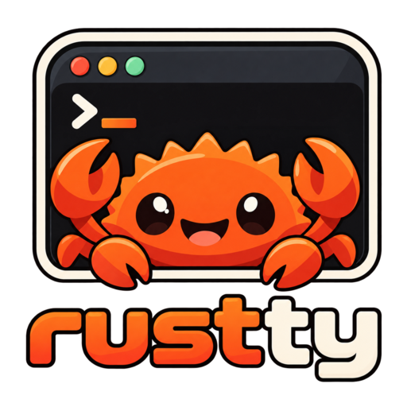

<p align="center">
  
</p>

# rustty

Émulateur de terminal accéléré par GPU, écrit en Rust, inspiré de
[kitty](https://sw.kovidgoyal.net/kitty/).

> Statut : alpha utilisable. Le binaire `rustty` ouvre une fenêtre GPU, lance
> le shell, gère onglets (bouton ✕ au survol), splits, sélection, presse-papiers,
> scrollback, opacité, barres de split et couleurs d'onglets configurables,
> renommage des onglets, zoom de police et rechargement de la configuration à
> chaud. Les tests
> couvrent toute la logique ; le parcours manuel est dans `docs/e2e.md`.

## Développement

```bash
cargo test --workspace                       # tous les tests
cargo clippy --workspace --all-targets -- -D warnings
cargo insta review                           # accepter les snapshots de grille modifiés
```

Les tests de rendu comparent des images de référence (`crates/rustty-render/tests/golden/`)
produites avec la police embarquée DejaVu Sans Mono. Pour les régénérer après un
changement voulu du rendu : `UPDATE_GOLDEN=1 cargo test -p rustty-render --test offscreen`,
puis vérifier les PNG à l'œil avant de les committer.

## Installer

```bash
cargo install --path crates/rustty                          # depuis un clone du dépôt
cargo install --git https://github.com/yrbane/rustty rustty # sans cloner
rustty --install-desktop                                    # Linux : lanceur et icône dans les menus
rustty --init-config                                        # fichier de configuration à éditer
```

Le binaire va dans `~/.cargo/bin` (à mettre dans le `PATH`). `--init-config`
écrit `~/.config/rustty/rustty.toml`, complet et commenté : les raccourcis se
redéfinissent dans sa section `[keys]` (`"none"` en délie un), et la
configuration se recharge à chaud.

## Lancer

```bash
cargo run -p rustty                      # fenêtre avec le shell par défaut
cargo run -p rustty -- --config ~/r.toml # autre fichier de configuration
cargo run -p rustty -- --hold            # garder le panneau quand le shell sort
RUSTTY_LOG=rustty=debug cargo run -p rustty  # journal détaillé
cargo run -p rustty -- --install-desktop # Linux : lanceur + icône dans les menus et la barre des tâches
```

Sous Linux, `--install-desktop` écrit `rustty.desktop` et les icônes sous
`~/.local/share` : GNOME, KDE et les autres associent alors la fenêtre
(identifiant `rustty`) à son icône. Sous Windows, l'icône est embarquée dans
l'exécutable. Les icônes se régénèrent depuis `assets/icon.svg` avec
`scripts/icons.sh`.

Raccourcis par défaut (modifiables dans `[keys]`) : `ctrl+shift+t` nouvel onglet,
`ctrl+shift+q` fermer l'onglet, `ctrl+shift+e` / `ctrl+shift+o` split vertical /
horizontal, `shift+flèches` focus, `ctrl+flèches` redimensionner, `ctrl+shift+c` /
`ctrl+shift+v` copier / coller, `shift+page_up` / `shift+page_down` historique, `ctrl+shift+left` / `ctrl+shift+right` ou `ctrl+shift+tab` / `ctrl+tab` onglet précédent / suivant, `alt+1`…`alt+5` onglet n, `ctrl+shift+z` zoom, `ctrl+shift+r` rotation, `ctrl+shift+f5` recharger la config, `ctrl+shift+alt+t` (ou double clic sur l'onglet) renommer l'onglet, `ctrl+plus` / `ctrl+minus` / `ctrl+0` et `ctrl+molette` taille de police du panneau survolé (les autres panneaux et la barre d'onglets ne changent pas). Un clic droit dans un panneau ouvre un menu (copier, coller, diviser, agrandir, renommer l'onglet, nouvel onglet, fermer le panneau ; `shift`+clic droit dans une application qui capte la souris). Les barres de split se glissent à la souris ; au redimensionnement, les lignes se réorganisent (reflow).

## Afficher une image

```bash
rustty img photo.png                     # fichier local
rustty img https://exemple.org/photo.jpg # URL http(s), 64 Mio au plus
alias img='rustty img'                   # à mettre dans ~/.bashrc ou ~/.zshrc
```

L'image s'affiche dans le panneau courant, via le protocole graphique de kitty ;
elle défile avec le texte, suit le zoom de police et disparaît avec `clear`.
Formats : PNG, JPEG, GIF (première image), WebP, BMP. Les images de plus de
2048 px de côté sont réduites avant l'envoi. `rustty img` marche aussi dans kitty.

## Objectifs de la v0.1

- Fenêtre rendue par le GPU via `wgpu`, sur Linux (Wayland et X11), macOS et Windows.
- Émulation VT solide avec scrollback, couleurs vraies, polices et emojis.
- Onglets avec bouton de fermeture cliquable et réactif au survol.
- Divisions horizontales et verticales de l'écran, redimensionnables au clavier.
- Opacité du fond, configuration en TOML rechargée à chaud, raccourcis configurables.

## Configuration

Nouveautés de personnalisation : `[splits]` (barre entre panneaux avec ou
sans, épaisseur, couleur fixe ou tirée au sort pour chaque division),
`[tabs]` `padding_horizontal`, `padding_vertical`, `spacing`, et `[tabs.colors]`
(couleurs des onglets, ou `random = true` pour une couleur vive tirée au sort
par onglet, texte automatiquement lisible), et `[window] osc52_clipboard`
(`true` par défaut ; `false` empêche les programmes d'écrire dans le
presse-papiers par la séquence OSC 52).

Fichier TOML, `~/.config/rustty/rustty.toml` sur Linux (équivalents macOS et
Windows). Toutes les clés sont optionnelles ; le fichier d'exemple
[`docs/rustty.example.toml`](docs/rustty.example.toml) liste chaque clé avec
sa valeur par défaut et les raccourcis fournis.

## Pile technique

`winit` · `wgpu` · `portable-pty` · `vte` · `fontdb` · `swash`

## Licence

GPL-3.0, voir [LICENSE](LICENSE).
